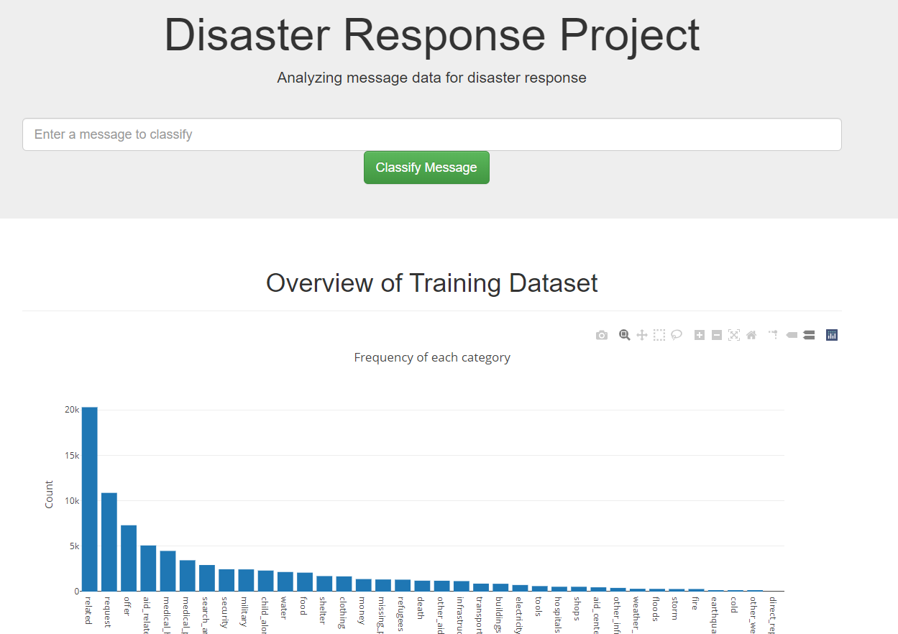

# Disaster Response Pipeline Project

### About
This repository is for the Disaster Response Pipeline Project of the Udacity Data Scientist Nanodegree.

### Content: 

#### Folders
- app: flask app, templates and and a helper module (starting_verb_extractor.py)
- data: original data and data processing script
- models: train script and a helper module (starting_verb_extractor.py)
- notebooks: course jupyter notebooks 

#### Files
- image.png: engaging image
- requirements.txt: used python packages

### Instructions:
1. Run the following command in the project's root directory to install the required packages.
    ```python
    pip install -r requirements.txt
    ```
   I highly recommend you to use virtual environment in order to separate this environment from your core python environment. For example,
    `python venv -m project3`
   
2. Run the following commands to set up your database and model. **You can skip this step as I already have set up all required data and model. Before you run the following commands, you need to delete data/project.db and models/classifier.pkl**

    - To run ETL pipeline that cleans data and stores in database
        `python data/process_data.py data/disaster_messages.csv data/disaster_categories.csv data/project.db`
    - To run ML pipeline that trains classifier and saves
        `python models/train_classifier.py data/project.db models/classifier.pkl`

3. Run the following command in the app's directory to run your web app.
    `python app/run.py`

4. Go to http://0.0.0.0:3001/ or http://localhost:3001/ 


